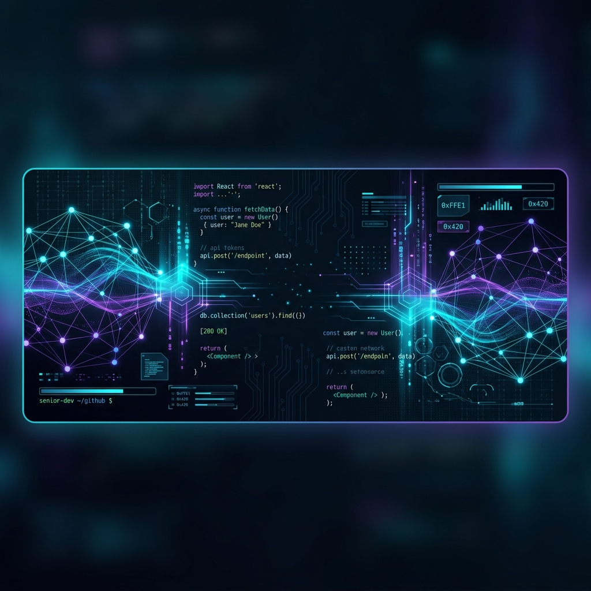
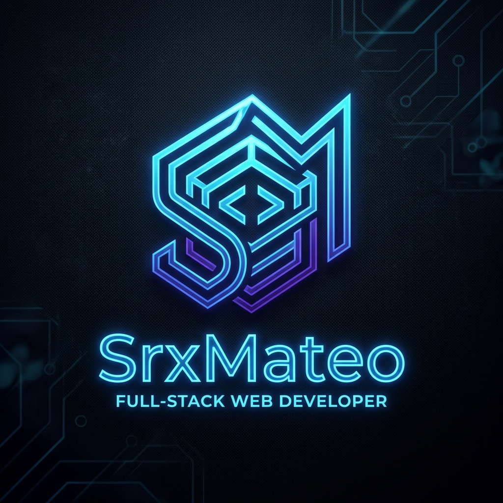

  
    
  
  
  <h1 align="center">SrxMateo   Senior Full-Stack & Systems Architect</h1>

  

    <em>"Transformando ideas complejas en experiencias digitales modernas, escalables y seguras."</em>
  

  

    
    
    
  

---

## 🚀 Sobre Mí

Soy un arquitecto de software y desarrollador apasionado por la excelencia técnica. Mi enfoque va más allá de escribir código; diseño **ecosistemas digitales** robustos. Desde la arquitectura de servidores (VPS, Linux, Nginx) hasta interfaces frontend dinámicas y APIs seguras.

<b>🛠️ Stack Tecnológico Premium</b>

 

  <table>
    <tr>
      <td align="center"><b>Frontend & UI</b></td>
      <td align="center"><b>Backend & Core</b></td>
      <td align="center"><b>Infraestructura & Ops</b></td>
    </tr>
    <tr>
      <td>
          
          
          
        
      </td>
      <td>
          
          
          
        
      </td>
      <td>
          
          
          
        
      </td>
    </tr>
  </table>

---

## 🏆 Portafolio de Proyectos Destacados

  <table>
    <tr>
      <td width="50%" align="center">
        <h3>🎓 LAcademy</h3>
        
<i>Hub de Aprendizaje Pro con IA</i>

        
Plataforma educativa de alto rendimiento diseñada para centralizar cursos y recursos de desarrollo con integración de módulos IA.

        
        
      </td>
      <td width="50%" align="center">
        <h3>🌌 Lumax Corp</h3>
        
<i>Plataforma y Ecosistema</i>

        
El proyecto núcleo que engloba herramientas, servidores profesionales de Minecraft y arquitectura web avanzada.

        
        
      </td>
    </tr>
    <tr>
      <td width="50%" align="center">
        <h3>⚙️ LServer</h3>
        
<i>Gestor de Herramientas (Python)</i>

        
Arquitectura Backend robusta creada en Python para la administración de utilidades de servidor.

        
      </td>
      <td width="50%" align="center">
        <h3>🤖 AI Skills Engine</h3>
        
<i>Custom Tools</i>

        
Colección de skills y agentes de IA autónomos (arquitectura de CLI, debuggers, auditores de seguridad).

        
      </td>
    </tr>
  </table>

---

## 📈 GitHub Stats

  
  

 

  <i>Arquitectado y diseñado por IA y SrxMateo</i>

